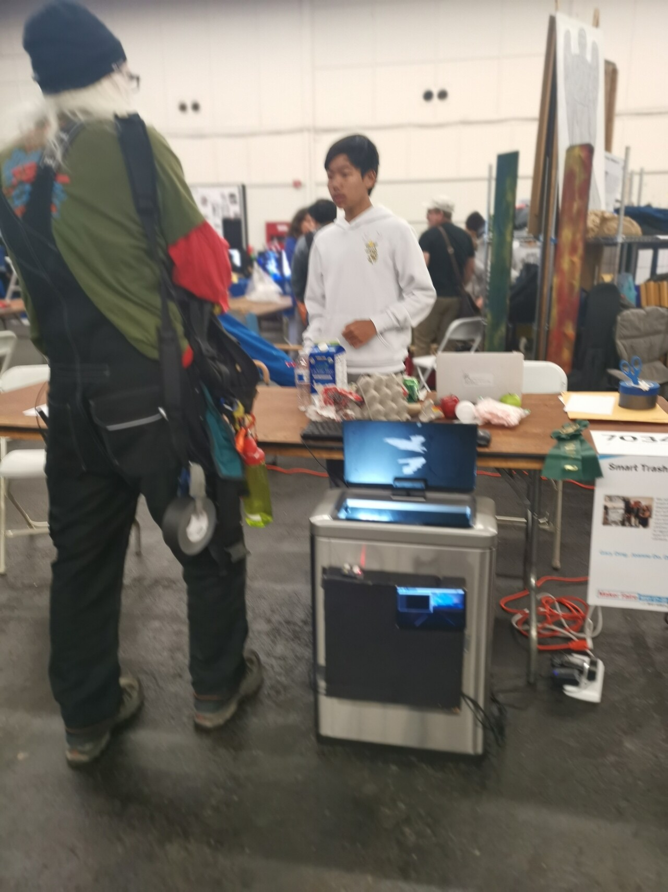
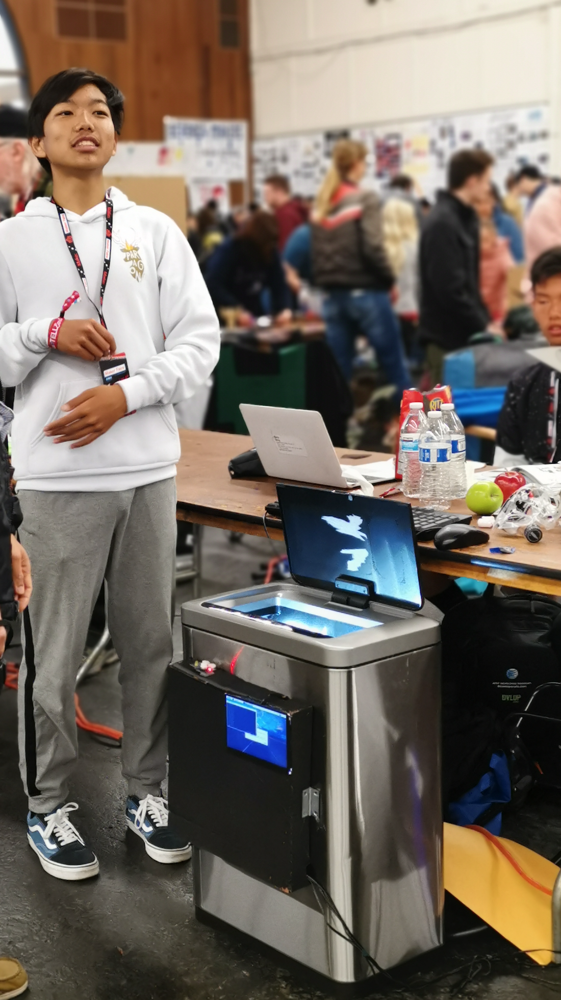
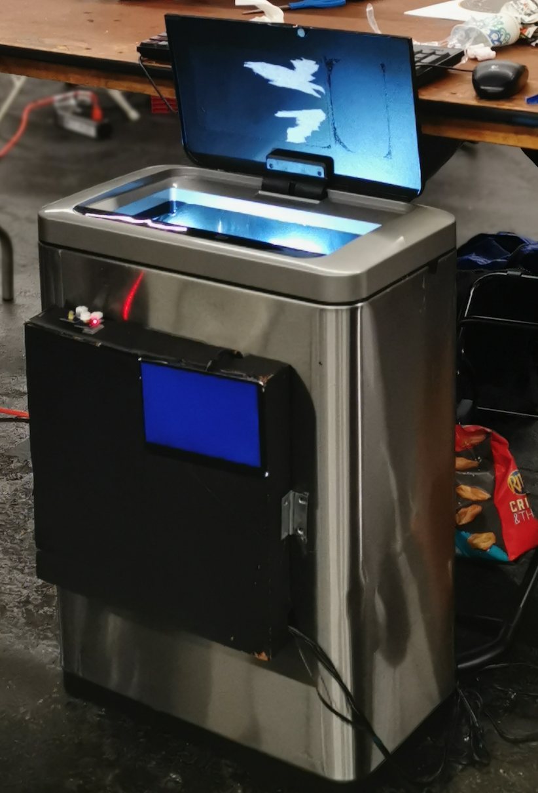
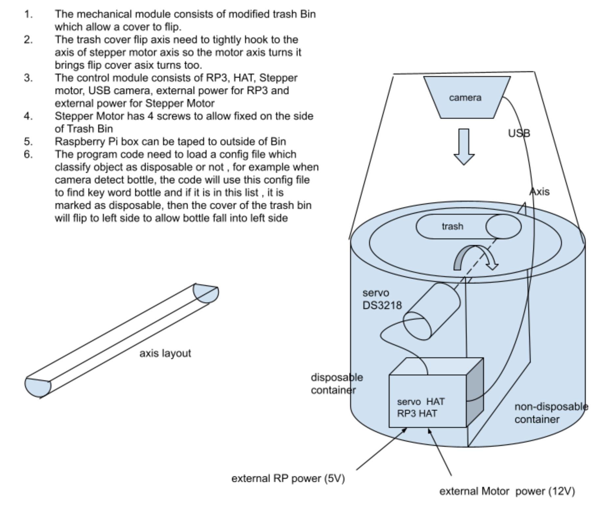
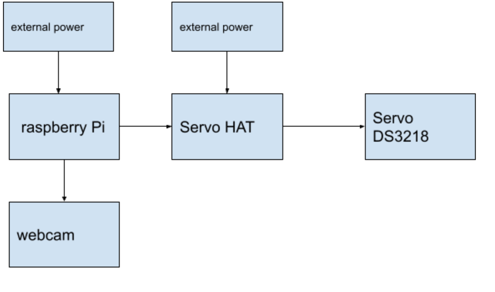

# Smart Trash Can 

## Introduction
This project solved the problem of  "Where does it go?!". It was designed to make throwing things away faster and more reliable.

This project utilized Machine Learning (ML) model to perform object classification to find if waste is disposal or non-disposal type. A 46L trash can was used to collect the waste.  Based on the result from machine learning a servo will route the waste to different side inside the trash can. In another word, the ML model inside the Raspberry Pi 3 will to control a servo to flip the trash into waste or recycle compartment.







## Requirement
- Support dark condition inside the trash bin 
- Need to use Real trash can 
- The object classification is limited object to 23 classes.
- System should  find out disposal and non-disposal type and turn into waster/recycle compartment


## Software
- [training.py](training.py): This code is to train model. The data was collected from pictures in data folder and trained from a PC with GTX1080 GPU. The model was then copied to raspberry Pi 3 SD card. Note the Tensorflow version has to be matched in PC and raspberry Pi to avoid model compatibility issue.
- [inference_rp3.py](inference.py): This code is to run inference from model from Raspberry Pi 3.
  
- [inference_clarifai.py](inference.py): This one is to run inference from model trained from Clarifai cloud service and run inference from Clarifai API directly.
- data: Directory Containing the training data.
- test: Directory Containing the test data.
- models: The model is for Raspberry Pi 3. The model was trained from a PC with Tensorflow with GTX1080 GPU.

## Hardware
- Adafruit 16-Channel PWM / Servo HAT
- Raspberry Pi 3
- DS3218 Servo
- Dual compartment 46L stainless steel trash can
- 7 Inches LCD Board for Raspberry Pi 3
  
Inside the trash can there are two compartments which hold either waster or recycles. On top of these two compartments there is a square plate to hold the trash as the first step. Once the light sensor detected a trash was thrown the inference process will be started. The plate is then turned left or right controlled by Raspberry Pi over a servo hat. Depending on the inference result the servo  will turn clock-wise or counter-clockwise so the plate will flip to waster compartment or recycle compartment. 

A 7 inch LCD display to installed outside of the trash can to provide the status of the processing.







## Training

Sample code for training
```bash
python training.py --epoch 1000 --batch_size 32 --model models/model1.h5
```

## Inference


```bash
python inference_rp3.py
```
or 

```bash
python inference_clarifair.py
```